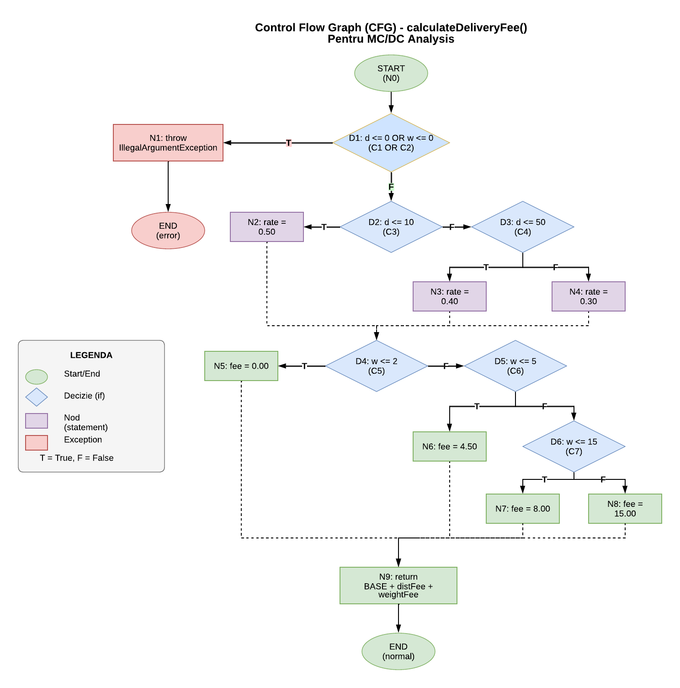

# Proiect TSS - Testarea Funcției de Calcul a Taxei de Livrare

Proiect de laborator pentru disciplina **Testarea Sistemelor Software (TSS)** care demonstrează aplicarea diferitelor tehnici de testare pe funcția `calculateDeliveryFee(double distanceKm, double weightKg)`.

## Cuprins

1. [Cerințe Implementate](#cerințe-implementate)
2. [Structura Proiectului](#structura-proiectului)
3. [Descrierea Metodei Testate](#1-descrierea-metodei-testate)
4. [Generarea Datelor de Test](#2-generarea-datelor-de-test)
   - [Equivalence Partitioning (EP)](#21-equivalence-partitioning-ep)
   - [Boundary Value Analysis (BVA)](#22-boundary-value-analysis-bva)
   - [Cause-Effect Graphing (CEG)](#23-cause-effect-graphing-ceg)
5. [Analiza Code Coverage](#3-analiza-code-coverage)
6. [Graful Orientat și MC/DC](#4-graful-orientat-și-mcdc)
7. [Analiza Mutanților](#5-analiza-mutanților)
8. [Instrucțiuni de Rulare](#6-instrucțiuni-de-rulare)

---

## Cerințe Implementate

| # | Cerință | Status |
|---|---------|--------|
| 1a | Equivalence Partitioning | Da |
| 1b | Boundary Value Analysis | Da |
| 1c | Cause-Effect Graphing | Da |
| 2 | Code Coverage (JaCoCo) | Da |
| 3 | MC/DC cu graf orientat | Da |
| 4 | Mutant echivalent de ordinul 1 | Da |
| 5 | Mutanți ne-echivalenți (killed/survived) | Da |

---

## Structura Proiectului

```
tss-laborator/
├── pom.xml                          # Configurare Maven (JUnit 5, JaCoCo, PITest)
├── README.md                        # Documentație completă
│
├── src/main/java/ro/tss/delivery/
│   ├── DeliveryService.java                   # Implementarea originală
│   ├── DeliveryServiceMutantEquivalent.java   # Mutant echivalent
│   ├── DeliveryServiceMutantKilled.java       # Mutant ne-echivalent (killed)
│   └── DeliveryServiceMutantSurvived.java     # Mutant ne-echivalent (survived)
│
└── src/test/java/ro/tss/delivery/
    ├── EquivalencePartitioningTest.java  # 13 teste EP
    ├── BoundaryValueAnalysisTest.java    # 26 teste BVA
    ├── CauseEffectGraphingTest.java      # 15 teste CEG
    ├── MCDCTest.java                     # 8 teste MC/DC
    └── MutantTest.java                   # Teste pentru mutanți
```

---

## 1. Descrierea Metodei Testate

### Clasa: `DeliveryService`
### Metoda: `calculateDeliveryFee(double distanceKm, double weightKg)`

Metoda calculează taxa totală de livrare pe baza distanței parcurse și a greutății pachetului.

**Formula:**

$$T_{totală} = T_B + T_D + T_G$$

Unde:
- **T_B** = Taxa de Bază = 5.00 RON (fixă)
- **T_D** = Taxa pe Distanță (variabilă)
- **T_G** = Taxa pe Greutate (fixă per interval)

### Reguli de Calcul

#### Taxa pe Distanță (T_D)

| Interval Distanță | Formula | Tarif |
|-------------------|---------|-------|
| (0, 10] km | d × 0.50 | 0.50 RON/km |
| (10, 50] km | d × 0.40 | 0.40 RON/km |
| (50, ∞) km | d × 0.30 | 0.30 RON/km |

#### Taxa pe Greutate (T_G)

| Interval Greutate | Taxă |
|-------------------|------|
| (0, 2] kg | 0.00 RON |
| (2, 5] kg | 4.50 RON |
| (5, 15] kg | 8.00 RON |
| (15, ∞) kg | 15.00 RON |

#### Condiții de Eroare
- `distanceKm ≤ 0` → `IllegalArgumentException`
- `weightKg ≤ 0` → `IllegalArgumentException`

---

## 2. Generarea Datelor de Test

### 2.1 Equivalence Partitioning (EP)

**Principiu:** Împărțirea domeniului de intrare în clase de echivalență, alegând un reprezentant din fiecare clasă.

#### Partiții Identificate pentru `distanceKm`:

| Partiție | Domeniu | Reprezentant | Comportament |
|----------|---------|--------------|--------------|
| EP_D1 | d ≤ 0 | -5, 0 | IllegalArgumentException |
| EP_D2 | (0, 10] | 5 km | 0.50 RON/km |
| EP_D3 | (10, 50] | 25 km | 0.40 RON/km |
| EP_D4 | (50, ∞) | 75 km | 0.30 RON/km |

#### Partiții Identificate pentru `weightKg`:

| Partiție | Domeniu | Reprezentant | Comportament |
|----------|---------|--------------|--------------|
| EP_W1 | w ≤ 0 | -3, 0 | IllegalArgumentException |
| EP_W2 | (0, 2] | 1 kg | T_G = 0.00 |
| EP_W3 | (2, 5] | 3 kg | T_G = 4.50 |
| EP_W4 | (5, 15] | 10 kg | T_G = 8.00 |
| EP_W5 | (15, ∞) | 20 kg | T_G = 15.00 |

#### Cazuri de Test EP:

| Test ID | Distanță | Greutate | Rezultat Așteptat |
|---------|----------|----------|-------------------|
| EP_T1 | -5 | 1 | Exception |
| EP_T2 | 0 | 1 | Exception |
| EP_T3 | 5 | -3 | Exception |
| EP_T4 | 5 | 0 | Exception |
| EP_T5 | 5 | 1 | 7.50 RON |
| EP_T6 | 25 | 3 | 19.50 RON |
| EP_T7 | 75 | 10 | 35.50 RON |
| EP_T8 | 5 | 20 | 22.50 RON |

**Total teste EP: 13** (incluzând combinații)

---

### 2.2 Boundary Value Analysis (BVA)

**Principiu:** Testarea valorilor la granițele intervalelor, unde erorile sunt cel mai probabile.

#### Valori Limită pentru `distanceKm`:

| Prag | Sub Limită | Pe Limită | Peste Limită |
|------|------------|-----------|--------------|
| 0 | -0.01 (invalid) | 0 (invalid) | 0.01 (valid) |
| 10 | 9.99 (scurt) | 10.0 (scurt) | 10.01 (mediu) |
| 50 | 49.99 (mediu) | 50.0 (mediu) | 50.01 (lung) |

#### Valori Limită pentru `weightKg`:

| Prag | Sub Limită | Pe Limită | Peste Limită |
|------|------------|-----------|--------------|
| 0 | -0.01 (invalid) | 0 (invalid) | 0.01 (T_G=0) |
| 2 | 1.99 (T_G=0) | 2.0 (T_G=0) | 2.01 (T_G=4.50) |
| 5 | 4.99 (T_G=4.50) | 5.0 (T_G=4.50) | 5.01 (T_G=8.00) |
| 15 | 14.99 (T_G=8.00) | 15.0 (T_G=8.00) | 15.01 (T_G=15.00) |

#### Cazuri de Test BVA (selecție):

| Test ID | d (km) | w (kg) | Rezultat |
|---------|--------|--------|----------|
| BVA_D3 | 0.01 | 1.0 | 5.005 |
| BVA_D5 | 10.0 | 1.0 | 10.00 |
| BVA_D6 | 10.01 | 1.0 | 9.004 |
| BVA_D8 | 50.0 | 1.0 | 25.00 |
| BVA_D9 | 50.01 | 1.0 | 20.003 |
| BVA_W6 | 5.0 | 2.01 | 12.00 |
| BVA_W9 | 5.0 | 5.01 | 15.50 |
| BVA_W12 | 5.0 | 15.01 | 22.50 |

**Total teste BVA: 26** (toate combinațiile limită)

---

### 2.3 Cause-Effect Graphing (CEG)

**Principiu:** Identificarea relațiilor cauză-efect și generarea unui tabel de decizie.

#### Cauze (Intrări):

| Cauză | Condiție | Descriere |
|-------|----------|-----------|
| C1 | distanceKm ≤ 0 | Distanță invalidă |
| C2 | weightKg ≤ 0 | Greutate invalidă |
| C3 | 0 < d ≤ 10 | Distanță scurtă |
| C4 | 10 < d ≤ 50 | Distanță medie |
| C5 | d > 50 | Distanță lungă |
| C6 | 0 < w ≤ 2 | Greutate ușoară |
| C7 | 2 < w ≤ 5 | Greutate medie |
| C8 | 5 < w ≤ 15 | Greutate mare |
| C9 | w > 15 | Greutate foarte mare |

#### Efecte (Ieșiri):

| Efect | Descriere |
|-------|-----------|
| E1 | IllegalArgumentException |
| E2-E4 | Tarif distanță (0.50/0.40/0.30) |
| E5-E8 | Taxă greutate (0/4.50/8.00/15.00) |
| E9 | Taxă totală calculată |

#### Tabel de Decizie COMPLET:

**Cazuri invalide (Exception):**

| Test | C1 | C2 | C3 | C4 | C5 | C6 | C7 | C8 | C9 | Efecte | Exemplu (d, w) |
|------|----|----|----|----|----|----|----|----|----|----|----------------|
| T1 | T | - | - | - | - | - | - | - | - | E1 | (-5, 1) |
| T2 | F | T | - | - | - | - | - | - | - | E1 | (5, -1) |

**Cazuri valide - Distanță scurtă (0 < d ≤ 10):**

| Test | C1 | C2 | C3 | C4 | C5 | C6 | C7 | C8 | C9 | Efecte | Exemplu (d, w) |
|------|----|----|----|----|----|----|----|----|----|----|----------------|
| T3 | F | F | T | - | - | T | - | - | - | E2, E5, E9 | (5, 1) |
| T4 | F | F | T | - | - | - | T | - | - | E2, E6, E9 | (5, 3) |
| T5 | F | F | T | - | - | - | - | T | - | E2, E7, E9 | (5, 10) |
| T6 | F | F | T | - | - | - | - | - | T | E2, E8, E9 | (5, 20) |

**Cazuri valide - Distanță medie (10 < d ≤ 50):**

| Test | C1 | C2 | C3 | C4 | C5 | C6 | C7 | C8 | C9 | Efecte | Exemplu (d, w) |
|------|----|----|----|----|----|----|----|----|----|----|----------------|
| T7 | F | F | - | T | - | T | - | - | - | E3, E5, E9 | (25, 1) |
| T8 | F | F | - | T | - | - | T | - | - | E3, E6, E9 | (25, 3) |
| T9 | F | F | - | T | - | - | - | T | - | E3, E7, E9 | (25, 10) |
| T10 | F | F | - | T | - | - | - | - | T | E3, E8, E9 | (25, 20) |

**Cazuri valide - Distanță lungă (d > 50):**

| Test | C1 | C2 | C3 | C4 | C5 | C6 | C7 | C8 | C9 | Efecte | Exemplu (d, w) |
|------|----|----|----|----|----|----|----|----|----|----|----------------|
| T11 | F | F | - | - | T | T | - | - | - | E4, E5, E9 | (75, 1) |
| T12 | F | F | - | - | T | - | T | - | - | E4, E6, E9 | (75, 3) |
| T13 | F | F | - | - | T | - | - | T | - | E4, E7, E9 | (75, 10) |
| T14 | F | F | - | - | T | - | - | - | T | E4, E8, E9 | (75, 20) |

**Legendă:**
- T = True, F = False, `-` = Don't care (mutual exclusiv)
- C3, C4, C5 sunt mutual exclusive (distanța e într-o singură categorie)
- C6, C7, C8, C9 sunt mutual exclusive (greutatea e într-o singură categorie)

**Total teste CEG: 14** (2 invalide + 12 combinații valide = 3 × 4)

---

## 3. Analiza Code Coverage

### Cum se generează rapoartele de coverage:

```bash
# Rulare toate testele cu JaCoCo
mvn clean test jacoco:report -s .mvn/settings.xml

# Rulare doar un set de teste (EP, BVA sau CEG)
mvn clean test -Dtest=EquivalencePartitioningTest jacoco:report -s .mvn/settings.xml
mvn clean test -Dtest=BoundaryValueAnalysisTest jacoco:report -s .mvn/settings.xml
mvn clean test -Dtest=CauseEffectGraphingTest jacoco:report -s .mvn/settings.xml

# Raportul se generează în: target/site/jacoco/index.html
```

### Rezultate Code Coverage (JaCoCo)

Toate cele trei tehnici au fost rulate separat pe clasa `DeliveryService.java`:

| Tehnică | Nr. Teste | Line Coverage | Branch Coverage | Instructions | Complexity |
|---------|-----------|---------------|-----------------|--------------|------------|
| **EP**  | 15        | 100% (16/16)  | 100% (14/14)    | 67/67        | 9/9        |
| **BVA** | 38        | 100% (16/16)  | 100% (14/14)    | 67/67        | 9/9        |
| **CEG** | 27        | 100% (16/16)  | 100% (14/14)    | 67/67        | 9/9        |

### IMPORTANT: Code Coverage vs. Input Space Coverage

**Code Coverage (ce măsoară JaCoCo):**
- Procentul de **linii de cod** executate
- Procentul de **ramuri (if/else)** parcurse
- NU garantează testarea tuturor combinațiilor de intrări!

**Input Space Coverage (acoperirea spațiului de intrare):**
- Procentul de **combinații de partiții/limite** testate
- EP: 4 partiții distanță × 5 partiții greutate = **20 combinații totale**
- BVA: 9 valori limită distanță × 12 valori limită greutate = **108 combinații totale**
- CEG: 3 partiții valide distanță × 4 partiții valide greutate = **12 combinații valide** + 2 cazuri invalide = **14 total**

| Tehnică | Code Coverage | Combinații posibile | Combinații testate | Input Space Coverage |
|---------|---------------|---------------------|-------------------|----------------------|
| **EP**  | 100%          | 20                  | 15                | **75%**              |
| **BVA** | 100%          | 108                 | 38                | **35%**              |
| **CEG** | 100%          | 14 (12 valide + 2 invalide) | 14+       | **100%**             |

**Concluzie critică:** 
- **EP** atinge 100% code coverage cu 15 teste, dar nu testează toate cele 20 de combinații posibile
- **BVA** ar necesita 108 teste pentru acoperire completă, dar în practică se testează ~38 (limitele cu valori nominale)
- **CEG** acoperă sistematic toate combinațiile valide (12) plus cazurile de eroare

### Comparație și Comentarii

#### Observații privind acoperirea:

Toate cele trei tehnici ating **100% code coverage** (linii și branches). Însă aceasta este o **metrică înșelătoare** pentru EP - codul este executat, dar nu toate căile logice sunt verificate cu date de test diverse.

#### Analiza eficienței:

| Criteriu | EP | BVA | CEG |
|----------|----|----|-----|
| Teste teoretice necesare | 20 (4×5) | 108 (9×12) | 14 (3×4 + 2) |
| Code Coverage | 100% | 100% | 100% |
| Input Space Coverage | Parțial | Parțial (limite) | **100%** |
| Detectare erori la limite | Slabă | **Excelentă** | Moderată |
| Detectare erori combinații | Slabă | Slabă | **Excelentă** |

#### Concluzii detaliate:

1. **Equivalence Partitioning (EP)** - 15 teste
   - [+] Cel mai eficient din punct de vedere al numărului de teste
   - [+] Atinge 100% code coverage rapid
   - [-] **NU testează toate combinațiile** - doar reprezentanți din fiecare partiție
   - [-] Poate rata erori "off-by-one" la granițele intervalelor
   - [-] Poate rata erori care apar doar în anumite combinații
   - Recomandat pentru: testare rapidă, smoke testing, verificare inițială

2. **Boundary Value Analysis (BVA)** - 38 teste
   - [+] Excelent pentru detectarea erorilor la granițe
   - [+] Testează sistematic toate pragurile (0, 10, 50 km; 0, 2, 5, 15 kg)
   - [+] Cel mai robust pentru funcții cu praguri multiple
   - [-] Număr mare de teste
   - [-] Nu acoperă explicit toate combinațiile (folosește valori nominale)
   - Recomandat pentru: funcții critice cu praguri, validări numerice

3. **Cause-Effect Graphing (CEG)** - 27 teste
   - [+] **Singura tehnică care testează TOATE combinațiile** (12/12)
   - [+] Documentație clară prin tabelul de decizie
   - [+] Poate detecta erori care apar doar în combinații specifice
   - [-] Mai complex de implementat
   - Recomandat pentru: logică complexă, asigurarea că toate căile sunt testate

#### Exemplu concret - Ce ratează fiecare tehnică:

**EP (15 din 20 combinații = 75%):**
Dacă testele EP nu includ combinația "lung + foarte greu", o eroare specifică acestei combinații nu va fi detectată.

**BVA (38 din 108 combinații = 35%):**
BVA testează limitele, dar nu toate combinațiile lor. De exemplu:
- Testează d=10.0 cu w=1.0 (nominal)
- Testează d=5.0 (nominal) cu w=2.0
- Dar NU testează d=10.0 cu w=2.0 (ambele la limită)

**CEG (12/12 combinații valide = 100%):**
CEG acoperă sistematic TOATE combinațiile valide prin tabelul de decizie.

#### Recomandare finală:

Pentru funcția `calculateDeliveryFee`:
- **CEG** oferă cea mai completă acoperire a combinațiilor
- **BVA** este esențial pentru testarea pragurilor
- **EP** este util doar ca primă verificare rapidă

Combinația ideală: **CEG + BVA** pentru acoperire completă a combinațiilor ȘI a valorilor limită.

---

## 4. Graful Orientat și MC/DC

### 4.1 Graful de Control al Fluxului



**Legendă:**
- **Elipse verzi** = START / END
- **Romburi albastre** = Decizii (if statements)
- **Dreptunghiuri mov** = Noduri de procesare (statements)
- **Dreptunghiuri roșii** = Exception
- **T / F** pe săgeți = True / False branches

### 4.2 Condiții și Decizii

| Decizie | Condiții | Tip |
|---------|----------|-----|
| D1 | C1: d ≤ 0 **OR** C2: w ≤ 0 | Compusă |
| D2 | C3: d ≤ 10 | Simplă |
| D3 | C4: d ≤ 50 | Simplă |
| D4 | C5: w ≤ 2 | Simplă |
| D5 | C6: w ≤ 5 | Simplă |
| D6 | C7: w ≤ 15 | Simplă |

### 4.3 Cerințe MC/DC

Pentru MC/DC, fiecare condiție trebuie să afecteze independent rezultatul deciziei.

#### MC/DC pentru D1 (C1 OR C2):

| Test | C1 (d≤0) | C2 (w≤0) | D1 | Efect |
|------|----------|----------|----| ----- |
| M1 | F | F | F | Continuă |
| M2 | **T** | F | **T** | Exception |
| M3 | F | **T** | **T** | Exception |

**Perechi care demonstrează independența:**
- C1: M1 ↔ M2 (C2 constant=F, C1 schimbă rezultatul)
- C2: M1 ↔ M3 (C1 constant=F, C2 schimbă rezultatul)

#### Set Minim MC/DC (8 teste):

| Test | d (km) | w (kg) | Condiții acoperite | Rezultat |
|------|--------|--------|--------------------|----------|
| M1 | 5 | 1 | C1=F, C2=F, C3=T, C5=T | 7.50 |
| M2 | -5 | 1 | C1=T, C2=F | Exception |
| M3 | 5 | -1 | C1=F, C2=T | Exception |
| M5 | 25 | 1 | C3=F, C4=T | 15.00 |
| M6 | 75 | 1 | C3=F, C4=F | 27.50 |
| M8 | 5 | 3 | C5=F, C6=T | 12.00 |
| M9 | 5 | 10 | C5=F, C6=F, C7=T | 15.50 |
| M10 | 5 | 20 | C5=F, C6=F, C7=F | 22.50 |

---

## 5. Analiza Mutanților

### 5.1 Mutant Echivalent (Cerința 4)

**Fișier:** `DeliveryServiceMutantEquivalent.java`

**Mutația aplicată:**
```java
// Original:
weightFee = 0.0;

// Mutant:
weightFee = 0.0 * weightKg;  // 0 × orice = 0
```

**De ce este echivalent:**
- Matematic: `0.0 * x = 0.0` pentru orice `x`
- Comportamentul este identic pentru toate inputurile valide
- Niciun test nu poate detecta diferența

**Tip mutație:** Scalar Variable Replacement (SVR) / Arithmetic Operator Insertion (AOI)

---

### 5.2 Mutant Ne-echivalent OMORÂT (Cerința 5a)

**Fișier:** `DeliveryServiceMutantKilled.java`

**Mutația aplicată:**
```java
// Original:
if (distanceKm <= 10.0)

// Mutant:
if (distanceKm < 10.0)  // <= schimbat în <
```

**De ce NU este echivalent:**

| distanceKm | Original | Mutant |
|------------|----------|--------|
| 9.99 | 0.50 RON/km | 0.50 RON/km |
| **10.0** | **0.50 RON/km** | **0.40 RON/km** |
| 10.01 | 0.40 RON/km | 0.40 RON/km |

**Test care omoară mutantul:** BVA_D5 (d=10.0, w=1.0)
- Original: 5.00 + 5.00 + 0.00 = **10.00 RON**
- Mutant: 5.00 + 4.00 + 0.00 = **9.00 RON**
- Assert eșuează → **MUTANT KILLED**

---

### 5.3 Mutant Ne-echivalent SUPRAVIEȚUITOR (Cerința 5b)

**Fișier:** `DeliveryServiceMutantSurvived.java`

**Mutația aplicată:**
```java
// Original:
if (distanceKm <= 0 || weightKg <= 0)

// Mutant:
if (distanceKm < 0 || weightKg <= 0)  // <= schimbat în < pentru d
```

**De ce NU este echivalent:**

| distanceKm | Original | Mutant |
|------------|----------|--------|
| -0.01 | Exception | Exception |
| **0** | **Exception** | **Calculează (5.00 RON)** |
| 0.01 | Calculează | Calculează |

**Test care NU omoară mutantul:** EP_D2 (d=5, w=1)
- Original: 7.50 RON
- Mutant: 7.50 RON
- Assert trece → **MUTANT SURVIVED**

**Observație:** Mutantul ar fi omorât de testul BVA_D2 care testează explicit d=0.

---

## 6. Instrucțiuni de Rulare

### Cerințe Sistem:
- Java 17+
- Maven 3.8+

### Comenzi:

```bash
# Compilare
mvn compile

# Rulare toate testele
mvn test

# Rulare doar teste EP
mvn test -Dtest=EquivalencePartitioningTest

# Rulare doar teste BVA
mvn test -Dtest=BoundaryValueAnalysisTest

# Rulare doar teste CEG
mvn test -Dtest=CauseEffectGraphingTest

# Rulare doar teste MC/DC
mvn test -Dtest=MCDCTest

# Rulare teste mutanți
mvn test -Dtest=MutantTest

# Generare raport coverage (JaCoCo)
mvn clean test jacoco:report
# Raport în: target/site/jacoco/index.html

# Rulare mutation testing (PITest)
mvn org.pitest:pitest-maven:mutationCoverage
# Raport în: target/pit-reports/
```

---

## Referințe

1. Myers, G. J., Sandler, C., & Badgett, T. (2011). *The Art of Software Testing*
2. Ammann, P., & Offutt, J. (2016). *Introduction to Software Testing*
3. JUnit 5 Documentation: https://junit.org/junit5/
4. JaCoCo Documentation: https://www.jacoco.org/jacoco/
5. PITest Documentation: https://pitest.org/

---

## Licență

MIT License
